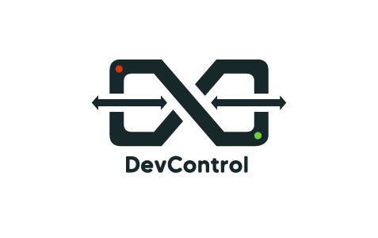
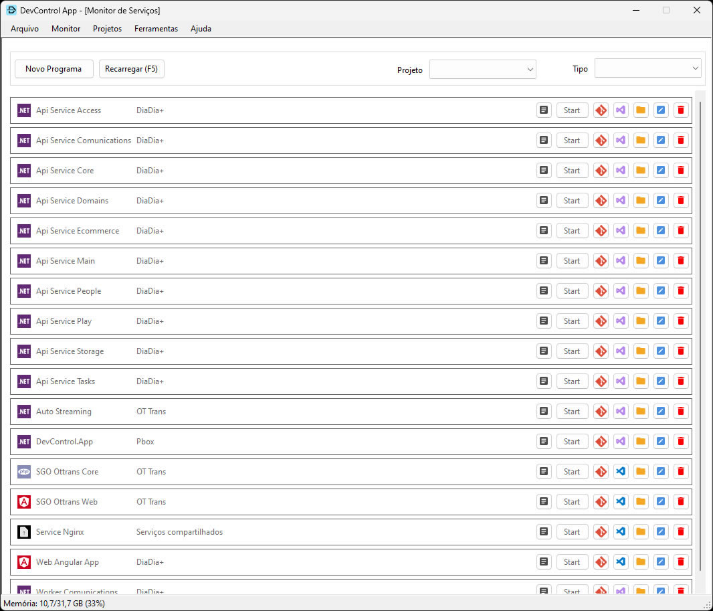
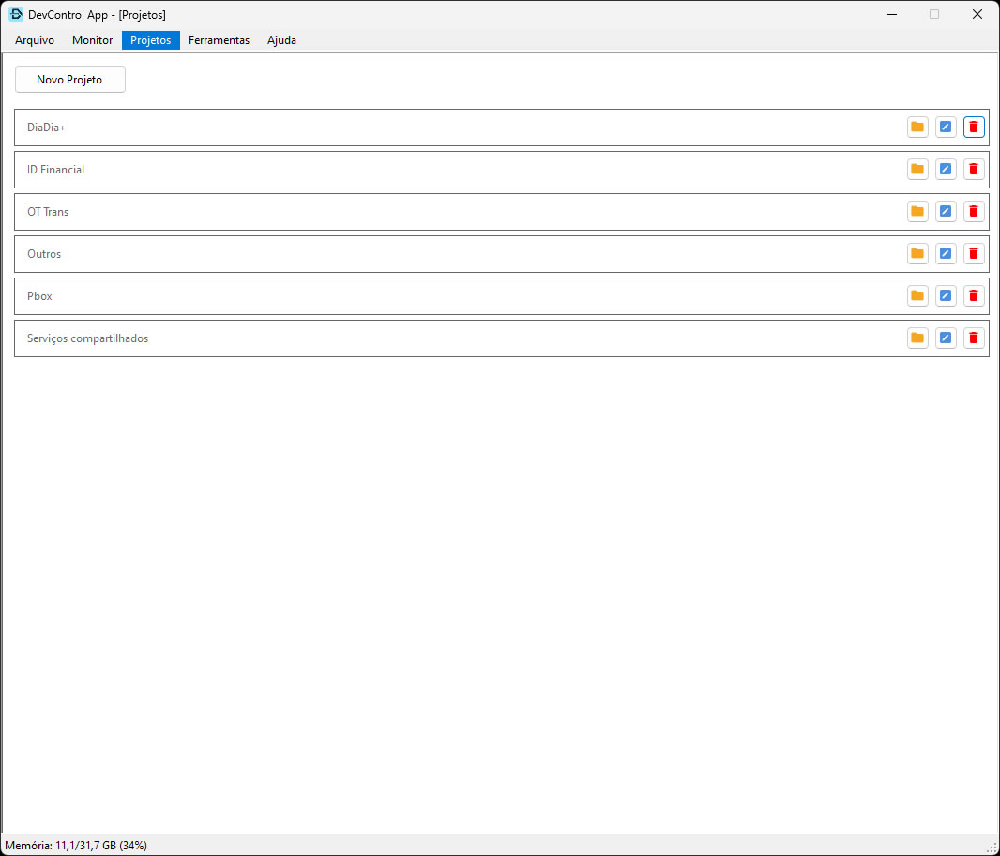
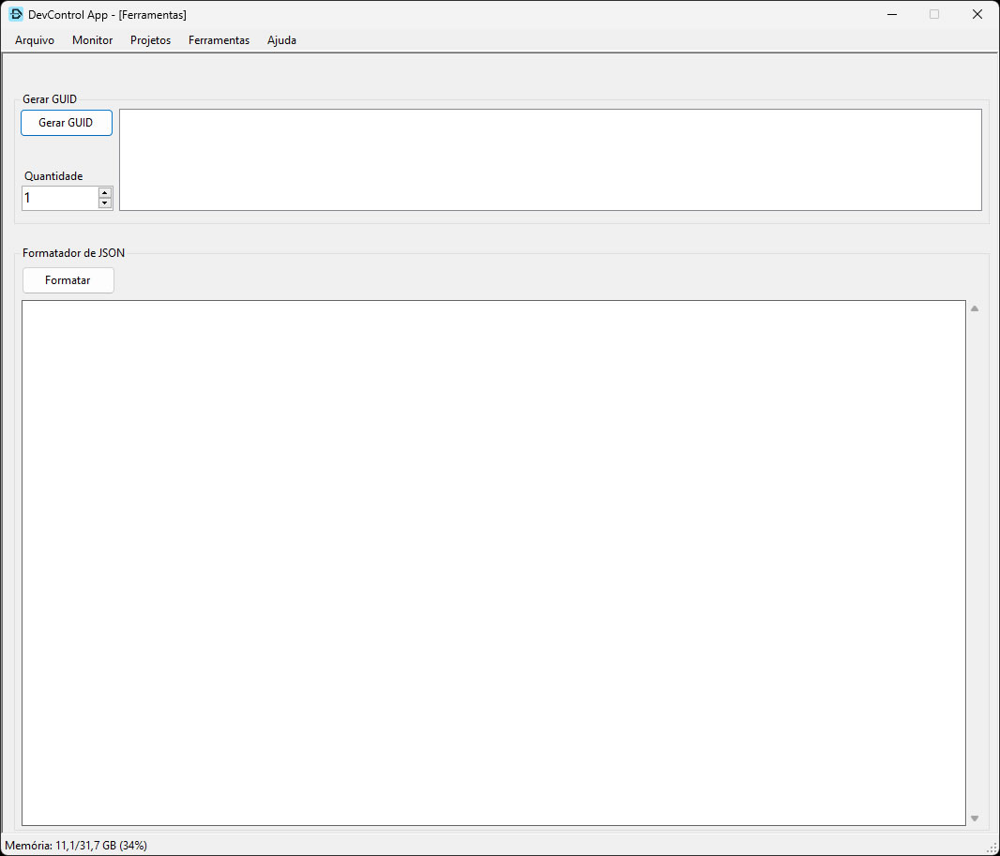
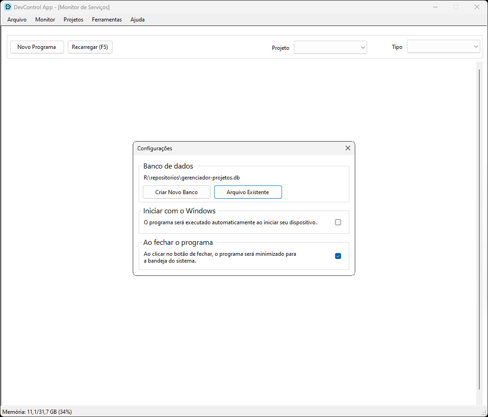

# DevControl App

  

**DevControl App** é uma ferramenta desenvolvida para facilitar o gerenciamento de projetos e programas de desenvolvimento. Este aplicativo foi criado para resolver a necessidade de executar múltiplas linhas de comando, buscar diretórios de projetos e repositórios de código, tudo isso de forma centralizada e eficiente.

## Funcionalidades

- **Cadastro de Projetos**: Permite cadastrar e gerenciar projetos de forma centralizada.
- **Cadastro de Programas**:
  - Suporta diferentes tipos de programas (.Net, Angular, PHP).
  - Botão para iniciar o serviço.
  - Botão para acessar o diretório do código.
  - Botão para acessar o repositório de código.
  - Visualização de logs.
- **Ferramentas Adicionais**:
  - Geração de GUID.
  - Formatação de JSON.

## Tecnologias Utilizadas

- **Linguagem**: C#
- **Framework**: .NET
- **Interface Gráfica**: Windows Forms

## Versão
A versão atual do DevControl App é **1.0.0**.

## Prints

  
  

  

  
  

  

  
  

  

  

## Licença
Este projeto é licenciado sob os termos da licença MIT. Veja o arquivo LICENSE para mais detalhes.

## Contato
Se você tiver alguma dúvida ou sugestão, sinta-se à vontade para abrir uma issue ou enviar um e-mail para estevao.silva@pbox.com.br.

## Current Release
[Download versão 1.5.3](https://github.com/pboxlab/devcontrol.app/releases/download/1.5.3/DevControlApp-1.5.3-Setup.exe)

- Verificação e Validação do Banco de Dados na Inicialização; [#1](https://github.com/pboxlab/devcontrol.app/issues/1)
- Atualizar combobox projetos ao clicar no botão de recarregar [#2](https://github.com/pboxlab/devcontrol.app/issues/2)
- Configuração de Injeção de Dependências Global;
- Melhoria no Tratamento de Exceções;
- Refatoração das Classes de Repositórios;
- Aprimoramento do Método OpenPathClick;
- Correção de Chamadas Assíncronas;
- Ajuste nas Nomenclaturas dos Métodos;
- Refatoração da Classe WindowMonitor;
- Configurar fornecedor no instalador. [#3](https://github.com/pboxlab/devcontrol.app/issues/3)